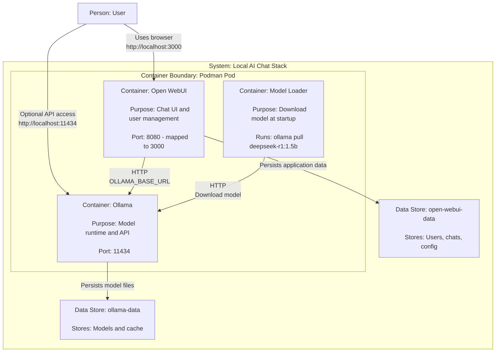

# Ollama + Open WebUI + DeepSeek con Podman Compose

Stack local para ejecutar **Ollama** (servidor de modelos) + **Open WebUI** (interfaz web tipo chat) usando **Podman Compose**.

---

## Arquitectura rápida

- **ollama** → API de modelos en `http://localhost:11434`
- **open-webui** → Interfaz web en `http://localhost:3000`
- **model-loader** → Contenedor one-shot que descarga el modelo `deepseek-r1:1.5b` y luego finaliza



---

## Requisitos

- Podman
- Podman Compose (`podman compose` o `podman-compose`)
- Puertos libres:
  - `11434` (Ollama)
  - `3000` (Open WebUI)

> Nota (SELinux): los volúmenes usan `:Z` para evitar errores de permisos en sistemas con SELinux activo.

---

## 1) Instalación

### 1.1 Instalar Podman

**Fedora / RHEL / CentOS**
```bash
sudo dnf install -y podman
```

**Ubuntu / Debian**
```bash
sudo apt update && sudo apt install -y podman
```

**macOS**
```bash
brew install podman
podman machine init
podman machine start
```

Verificar:
```bash
podman --version
```

---

### 1.2 Instalar Podman Compose

**Opción A: podman compose**
```bash
podman compose version
```

**Opción B: podman-compose**
Instalar:
```bash
pipx install podman-compose
# o
pip install --user podman-compose
```

Verificar:
```bash
podman-compose --version
```

---

## 2) Configuración

Crear un archivo `.env` en el mismo directorio que `podman-compose.yml`:

```env
WEBUI_SECRET_KEY=change-me-to-a-long-random-secret
ENABLE_SIGNUP=true
```

Generar una clave segura:
```bash
openssl rand -hex 32
```

---

## 3) Ejecución

Desde el directorio del proyecto:

```bash
podman compose -f podman-compose.yml up -d
```

Ver estado:
```bash
podman ps
podman compose -f podman-compose.yml ps
```

Accesos:
- Open WebUI → http://localhost:3000
- Ollama API → http://localhost:11434

> En el primer acceso, Open WebUI solicitará crear el primer usuario (admin). Es el comportamiento esperado.

---

## 4) Pruebas y validación

### 4.1 Verificar Ollama
```bash
curl http://localhost:11434
```

Respuesta esperada:
```
Ollama is running
```

---

### 4.2 Listar modelos
```bash
curl http://localhost:11434/api/tags
```

---

### 4.3 Validar Open WebUI
Abrir en el navegador:
```
http://localhost:3000
```

Crear usuario, iniciar sesión y probar un chat con el modelo.

---

### 4.4 Logs
```bash
podman logs ollama-deepseek
podman logs open-webui
podman logs model-loader
```

---

## 5) Detener y reiniciar

### Detener
```bash
podman compose -f podman-compose.yml stop
```

### Iniciar nuevamente
```bash
podman compose -f podman-compose.yml start
```

---

## 6) Destrucción

### 6.1 Bajar contenedores (mantiene datos)
```bash
podman compose -f podman-compose.yml down
```

### 6.2 Borrado total (⚠️ elimina volúmenes)
```bash
podman compose -f podman-compose.yml down -v
```

Esto elimina:
- Modelos descargados (Ollama)
- Usuarios y conversaciones (Open WebUI)

---

## Recomendaciones de seguridad

- Cambiar `WEBUI_SECRET_KEY` por una clave larga y aleatoria
- Después de crear el primer usuario, desactivar registros:
  ```env
  ENABLE_SIGNUP=false
  ```
  y recrear contenedores:
  ```bash
  podman compose -f podman-compose.yml up -d --force-recreate
  ```

---

## Estado esperado final

- Ollama respondiendo en `localhost:11434`
- Open WebUI accesible en `localhost:3000`
- Modelo disponible y funcional

---

🌍 Leer esto en: [English](README.md)